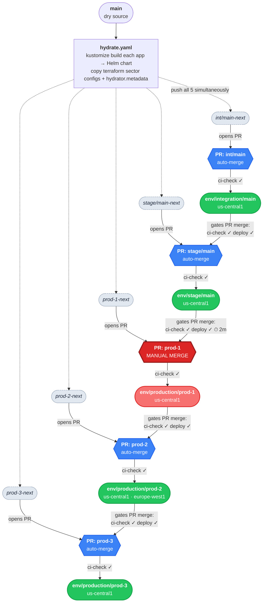

# Promotion flow

## How to read this diagram

- **Dotted arrows** from `hydrate.yaml`: content is pushed to **all 5 proposed branches simultaneously** on every push to `main`.
- **Solid arrows** from proposed branches: gitops-promoter opens a PR for each sector. The PR auto-merges once its own `ci-check` commit status is success.
- **Solid arrows** from active branches to PR nodes: the previous sector's `ci-check` and `deploy` commit statuses must be success before the next PR is allowed to merge. The ⏱ 2m on stage means a `TimedCommitStatus` enforces a soak period before prod-1 is unlocked.
- Promotion is **strictly sequential**: integration → stage → prod-1 → prod-2 → prod-3. prod-2 and prod-3 are not parallel — prod-3 is gated by prod-2.
- prod-1 requires **manual merge**; all others auto-merge once gates pass.

## Commit statuses

| Status | Set by | Checked by |
|--------|--------|------------|
| `ci-check` | `ci-checks.yaml` (YAML lint + `terraform validate`) | gitops-promoter as proposed commit status on each PR |
| `deploy` | `deploy.yaml` (fake deploy on active branch post-merge) | gitops-promoter as active commit status gating the next sector |
| `timer` | `TimedCommitStatus` CR (2-minute soak) | gitops-promoter as active commit status on stage only |
